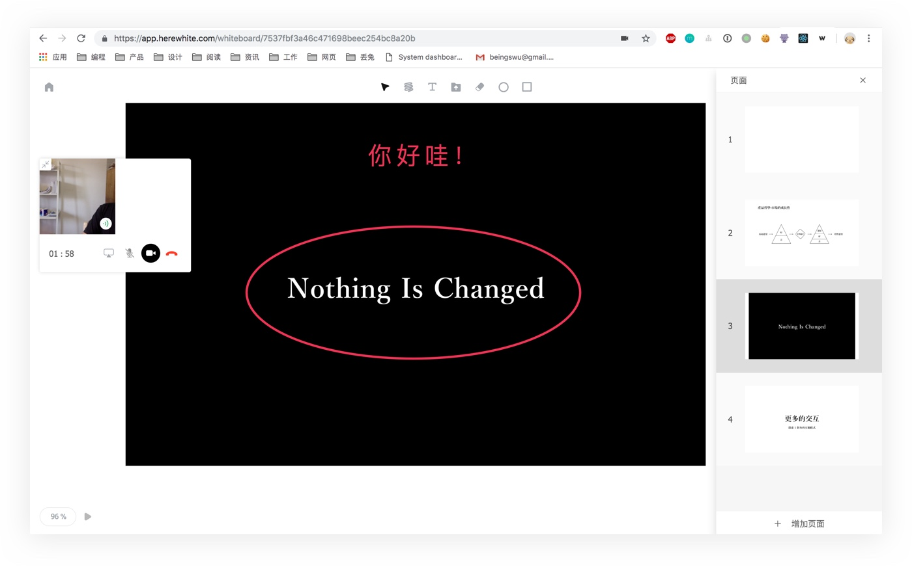

## white

> white 是一款全平台支持的实时互动白板，可以用于在线教育、会议、远程协作、设计审查、PPT 演示等场景。

查看 [项目简介](/zh-CN/v2/introduction.md) 了解详情。

### white 官方网站

我们在官网上做了详细的产品介绍，让用户可以更深入的了解 white 在教育、协作、会议等场景下的创新和优势。

[点击查看官网](https://www.herewhite.com)

### white web app

#### 针对个人用户和小团队用户：

我们提供了开箱即用的 White App。White App 覆盖了 iOS、Android、 Web、 小程序、Windows、Mac OS，等主流平台应用，用户只需要注册 White 个人帐号即可使用。

[点击使用 white 网页版](https://app.herewhite.com)

### white 控制台

#### 针对企业的级大客户：

我们提供了高可用的白板云服务 White Service。White Service 提供了 iOS、Android、Web 等主流平台的 SDK 和云端相关业务的线路优化、数据处理和存储分发一站式服务。客户只需要注册 White 企业帐号，获取证明企业身份的 White miniToken，就可以根据接入文档一键启动 White 互动白板。

[点击查看控制台](https://console.herewhite.com)

